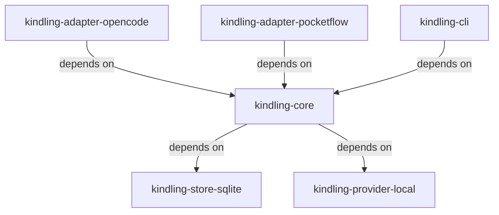

# Kindling OSS v0.1 — Local Memory & Continuity Engine

**Status:** Draft

---

## Overview

Kindling provides durable memory and contextual continuity to agentic and AI-assisted workflows. It captures what happened, preserves provenance, and makes context retrievable in a deterministic, explainable way — without asserting organisational truth or governance.

---

## Problem & Success Criteria

### Problem

AI-assisted development produces large volumes of transient activity (tool calls, diffs, agent runs) but loses context between sessions. Developers and local agents repeatedly re-discover the same information, leading to wasted time, architectural drift, and brittle workflows.

### Why this work matters

Kindling provides *continuity without judgement*. It captures what happened, preserves provenance, and makes context retrievable in a deterministic, explainable way, without asserting organisational truth or governance.

### Non-goals (explicit)

* Kindling does **not** decide what memory is authoritative
* Kindling does **not** promote or curate institutional memory
* Kindling does **not** manage organisational lifecycle, conflict resolution, or approval workflows

Those concerns belong to downstream systems (e.g. Edda) and are intentionally out of scope for OSS v0.1.

### Success Criteria

* A developer can resume work without re-explaining repo context
* Retrieval results are deterministic, scoped, and explainable
* All retrieved context can point to concrete evidence (files, diffs, commands, outputs)
* Kindling can be embedded and run locally with no external services
* The project is safe to open-source under Apache-2.0

---

## System Map

**Dependencies:**

* `kindling-core` → `kindling-store-sqlite`
* `kindling-core` → `kindling-provider-local`
* `kindling-adapter-opencode` → `kindling-core`
* `kindling-adapter-pocketflow` → `kindling-core`
* `kindling-cli` → `kindling-core`

---

## Milestones

### M1: Kindling OSS Scaffolding ✓

* Public repository created (`kindling`)
* Package boundaries enforced (core / store / provider / adapters)
* Architecture, data model, and retrieval contract docs published

**Target:** Repo builds, types compile, no runtime behaviour required

**Status:** Complete

---

### M2: Local Capture + Continuity (OpenCode)

* Observation ingestion via OpenCode adapter
* Session capsules (open/close)
* SQLite-backed system of record
* Local retrieval provider (FTS + recency)
* `/memory` command surface

**Target:** End-to-end local memory works in OpenCode

**Status:** In Progress

---

### M3: High-Signal Workflows (PocketFlow)

* PocketFlow adapter (vendored or dependency)
* Node-level capsules with intent hints
* Structured evidence capture

**Target:** Workflow-driven capsules outperform heuristic session summaries

**Status:** Not Started

---

### M4: OSS Hardening

* Redaction + pinning semantics
* Export/import
* Minimal CLI for inspection, debugging, and standalone use
* Documentation polish (README, examples)

**Target:** Safe, understandable OSS v0.1 release

**Status:** Not Started

---

## Modules

| Module | Scope | Owner | Priority | Status | Path |
|--------|-------|-------|----------|--------|------|
| **kindling-core** | KINDLING | @aneki | high | Draft | [modules/kindling-core.aps.md](./modules/kindling-core.aps.md) |
| **kindling-store-sqlite** | STORAGE | @aneki | high | Draft | [modules/kindling-store-sqlite.aps.md](./modules/kindling-store-sqlite.aps.md) |
| **kindling-provider-local** | RETRIEVAL | @aneki | high | Draft | [modules/kindling-provider-local.aps.md](./modules/kindling-provider-local.aps.md) |
| **kindling-adapter-opencode** | ADAPTER | @aneki | high | Draft | [modules/kindling-adapter-opencode.aps.md](./modules/kindling-adapter-opencode.aps.md) |
| **kindling-adapter-pocketflow** | ADAPTER | @aneki | medium | Draft | [modules/kindling-adapter-pocketflow.aps.md](./modules/kindling-adapter-pocketflow.aps.md) |
| **kindling-cli** | CLI | @aneki | medium | Draft | [modules/kindling-cli.aps.md](./modules/kindling-cli.aps.md) |

---

## Decisions

* **D-001:** Kindling is an infrastructure project; it captures context but does not assert truth
* **D-002:** SQLite is the default embedded system of record as it is deterministic, portable, auditable
* **D-003:** Retrieval must be deterministic and explainable
* **D-004:** All governance, promotion, and lifecycle logic is explicitly out of scope for Kindling OSS
* **D‑005:** Providers are accelerators, never sources of truth. This preserves provenance
* **D-006:** A minimal CLI ships in v0.1 to enable inspection, debugging, export/import, and use without adapters
* **D-007:** Summarisation is conservative in v0.1. Primary summaries occur on capsule close. Mid-capsule rollups are optional and triggered only by size or noise thresholds. Raw observations are retained by default
* **D-008:** DB location is configurable. Default is `~/.kindling/kindling.db` (or platform equivalent), with support for per-repo paths and explicit overrides
* **D-009:** Capsules auto-close when the source provides a natural end signal (e.g. session end, workflow node end). Otherwise, explicit close is required, with a safety timeout for inactivity
* **D-010:** Promotion and MemoryObjects are out of scope for Kindling OSS v0.1; pins and notes are the only persistence mechanism

---

## Risks

| Risk | Impact | Probability | Mitigation |
|------|--------|-------------|------------|
| SQLite FTS performance degrades with large datasets | High | Medium | Implement benchmarks early; add pagination and time-window filters; consider partitioning strategy if needed |
| Adapter event mappings miss critical context | High | Medium | Start with comprehensive logging; iterate based on dogfooding feedback; maintain mapping table for easy updates |
| Redaction implementation leaks sensitive data | High | Low | Design redaction-first; add tests for edge cases; document what gets captured in README |
| Module boundaries become unclear during implementation | Medium | Medium | Enforce dependency rules via package.json; regular architecture review checkpoints |

---

## Open Questions

*No open questions at this time.*

---

## Next Steps

**Immediate:** Begin STORAGE-001 — SQLite schema and initial migrations

See [execution/STORAGE-001.steps.md](./execution/STORAGE-001.steps.md) for detailed implementation steps.
